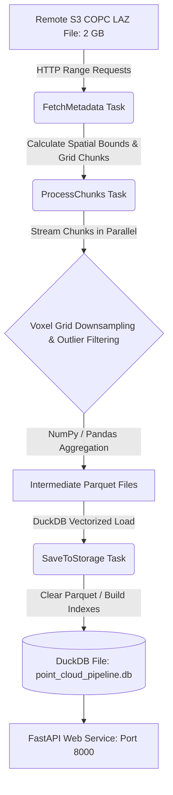

# Cloud-Optimized Point Cloud Pipeline

A modular, memory-efficient data pipeline that streams a remote 2 GB Cloud Optimized Point Cloud (COPC) file, downsamples and profiles it spatially, and bulk-loads it into a local DuckDB database.



---

## 1. Prerequisites

- **Python**: Version `3.10` or higher (tested with `3.12` on Windows and Linux).
- **Docker & Docker Compose**: (Optional, required for the containerized run).

---

## 2. How to Run Everything

### Local Environment Setup
1. **Create and Activate Virtual Environment**:
   ```bash
   # Create
   python -m venv .venv
   
   # Activate (Windows PowerShell)
   .venv\Scripts\Activate.ps1
   # Activate (Windows CMD)
   .venv\Scripts\activate.bat
   # Activate (macOS/Linux)
   source .venv/bin/activate
   ```
2. **Install Dependencies**:
   ```bash
   pip install -r requirements.txt
   ```

### Running the Ingestion Pipeline
- **Dry Run (Quick Verification - ~20 seconds)**:
  Runs the pipeline on a small subset (3 chunks) to verify end-to-end functionality:
  ```bash
  python run_pipeline.py --grid-size 8 --voxel-size 2.0 --workers 4 --max-chunks 3
  ```
- **Full Ingestion Run (~9-10 minutes)**:
  Processes the full 2 GB point cloud (364 million points):
  ```bash
  python run_pipeline.py --grid-size 8 --voxel-size 2.0 --workers 6
  ```
- **Resuming Failed Chunks (Recovery Mode)**:
  If any chunks failed to download during a previous run, their IDs are stored in the DuckDB metadata. You can re-run and append *only* those failed partitions:
  ```bash
  python run_pipeline.py --resume-failed
  ```

*Ingestion CLI Options:*
- `--grid-size`: Division of 2D space (default: `8` for an 8x8 grid).
- `--voxel-size`: Binned voxel cube size in coordinate units (default: `2.0` meters).
- `--workers`: Parallel worker threads for remote streaming (default: `4`).
- `--max-chunks`: Limit number of chunks processed (useful for testing).
- `--resume-failed`: Load failed chunks from database metadata and re-run only those partitions (preserves and appends to existing database).


### Running the Web Service
Once ingestion completes, start the FastAPI server:
```bash
uvicorn src.service.api:app --host 127.0.0.1 --port 8000
```
Access the interactive Swagger UI at: [http://127.0.0.1:8000/docs](http://127.0.0.1:8000/docs).

### Run via Docker Compose (Single Command)
Build and run the entire ingestion and web service stack inside containers:
```bash
docker-compose up
```
This automatically runs the ingestion pipeline, saves the DuckDB database to the local directory, closes the ingestion container, and starts the FastAPI app on port `8000`. Once started, the interactive API documentation and Swagger UI will be available at [http://127.0.0.1:8000/docs](http://127.0.0.1:8000/docs).

---

## 3. How to Verify the Storage Output

### Verification via SQL (DuckDB CLI)
Connect directly to the database to inspect the table and verify index performance:
```sql
-- Connect to the local DuckDB database
duckdb point_cloud_pipeline.db

-- 1. Check total binned voxels in the database
SELECT COUNT(*) FROM processed_voxels;

-- 2. Verify spatial index performance (B-Tree lookup on coordinate keys)
-- This should execute in < 1ms
SELECT * FROM processed_voxels 
WHERE voxel_x BETWEEN 188160 AND 188170 
  AND voxel_y BETWEEN 1878910 AND 1878920;
```

### Verification via API Endpoints
Call the FastAPI endpoints to retrieve insights:
1. **Health check**: `GET /health`
2. **System stats**: `GET /stats` (returns row counts, bounding boxes, and ingestion configuration).
3. **Densest clusters**: `GET /densest?limit=5` (retrieves voxels with the highest point count).
4. **Bounding Box Query**: `GET /voxels?min_x=188000&max_x=188200`

---

## 4. How to Run the Automated Test Suite

We have implemented a comprehensive test suite using `pytest` that covers both individual unit correctness and pipeline integration flows (specifically testing download failure tolerance).

### 1. Update Dependencies
Ensure `pytest` and `httpx` are installed:
```bash
pip install -r requirements.txt
```

### 2. Run All Tests
To run all tests with verbose output:
```bash
pytest tests/ -v
```

### 3. Key Areas Tested
*   **Voxelization & Noise Filters (`tests/test_voxels.py`)**: Validates coordinate downsampling, $3\sigma$ filters, and NaN replacements.
*   **DAG Scheduler Engine (`tests/test_dag.py`)**: Confirms Kahn's topological sort ordering, circular dependency guards, and task retry loops.
*   **Storage & Database (`tests/test_database.py`)**: Asserts DuckDB schemas, index rebuilds, and configuration log stores.
*   **FastAPI Routing (`tests/test_api.py`)**: Tests endpoints, bounding box parameter queries, and coordinate scaling logic.
*   **Chunk Recovery & Resilience (`tests/test_pipeline_integration.py`)**:
    *   Simulates a mock S3 download failure on a specific chunk. Asserts that the pipeline skips the chunk, writes warnings, completes successfully with remaining data, and saves failures to DuckDB metadata.
    *   Simulates the `--resume-failed` run. Asserts that it reads metadata, pulls only the failed chunk, and appends the recovered data.

---

## 5. Approach Section


### How the Work was Scoped

1. **Pipeline Architecture**: 
   Built a custom, lightweight Python DAG runner using **Kahn's Topological Sorting Algorithm**. This avoided massive, complex external frameworks (like Prefect, Airflow, or Dagster) which introduce system-level daemon dependencies, setup overhead, and compatibility issues on Windows/macOS.
2. **Enrichment: Voxel-Grid Downsampling & Statistical Profiling**:
   We selected Voxelization over alternative approaches (like DBSCAN clustering or C++ based Ground Extraction):
   - **Ground Extraction (CSF/PMF)**: Excluded due to compile-time C++ dependencies (PDAL bindings) that frequently break on clean installations.
   - **Clustering (DBSCAN)**: Excluded because running DBSCAN on millions of points requires $O(N \log N)$ to $O(N^2)$ complexity, causing memory spikes and Out-Of-Memory (OOM) worker crashes.
   - **Voxelization & Profiling**: Excels because it runs in $O(N)$ linear time using highly-optimized NumPy vector operations. It computes elevation variance (`std_z`) and density (`point_count`), which act as descriptors for vertical structures (high variance) versus flat terrain (zero variance), while compressing the data footprint by **~700x**.
3. **Storage Layer: DuckDB + Disk-Buffered Parquet**:
   We selected **DuckDB** over PostGIS or Delta Lake directories:
   - **vs. PostGIS**: PostGIS requires a running PostgreSQL server, port bindings, and user management. DuckDB is embedded and runs in-process with zero-config, keeping the pipeline portable.
   - **vs. Delta Lake / Parquet on disk**: Flat files require full-file scans for bounding box queries. DuckDB allows bulk-loading data from Parquet in **under 1.1 seconds** for 500k+ rows, and speeds up 3D queries via a multi-column B-Tree index on `(voxel_x, voxel_y, voxel_z)`.
4. **Concurrency Model**:
   Chose multi-threading (`ThreadPoolExecutor`) over multi-processing. Remote streaming via HTTP Range Requests is heavily network I/O bound; threading enables parallel network requests without the serialization overhead or platform-specific complexities (especially on Windows) of multiprocessing.

### Future Work & Scaling

- **Distributed Computing (100 GB+ datasets)**: Scale by swapping the local thread pool for a distributed framework like **Ray** or **Dask** (or cloud-native solutions like Google Cloud Dataflow/Dataproc, AWS Glue/EMR, or Azure Databricks).
- **Database & Storage Scaling**:
  - *MotherDuck*: Move to serverless cloud DuckDB (`md://`) to share databases instantly and run hybrid local/cloud queries.
  - *ClickHouse*: Migrate to ClickHouse for city-scale OLAP workloads requiring horizontal sharding and native geospatial indexes.
  - *Spatial Extensions*: Load data into PostGIS or enable the DuckDB Spatial extension for advanced geometric queries (e.g., street vector overlays, buffer calculations).

### What was Asked of AI
- **Syntax & API Lookups**: PyArrow Parquet writer properties, DuckDB's native Parquet loading parameters, and FastAPI query type definitions.
- **Code Quality**: Refactoring code readability, generating docstrings/comments, and formatting the initial structure of the FastAPI router and Swagger UI decorators.
- **Documentation**: Assisting with Markdown formatting and Mermaid diagram syntax.

### What was Verified Manually
- **DAG Execution Flow**: Verified task execution order, retry logic with backoff delays, and state passing between isolated tasks.
- **Memory Consumption**: Tracked memory footprint under high thread counts to ensure Python's heap stays under 500 MB during HTTP range-request streaming.
- **Database Performance**: Verified DuckDB B-Tree indexing query latency (<1ms lookup times).
- **Outlier & Noise Filtering**: Verified that elevation boundaries ($[-50, 150]$ meters) and the local $3\sigma$ filter correctly pruned spurious lidar noise.
- **Docker Compose Orchestration**: Manually verified that the API container waits to boot until the ingestion pipeline writes the database and completes.
